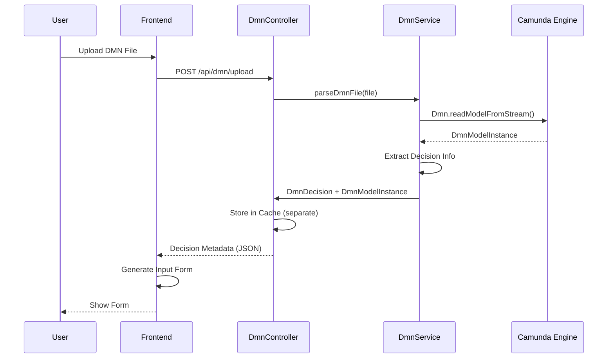
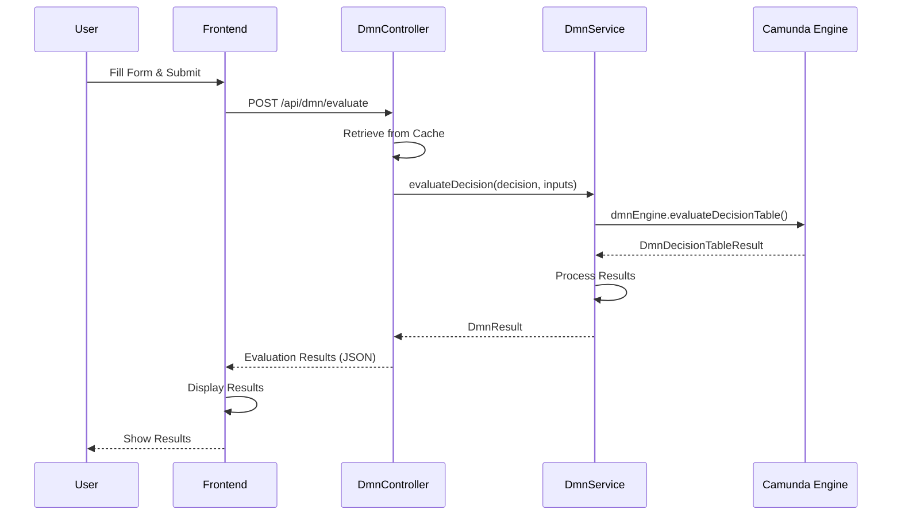

# MTM DMN Evaluator Simulator

[](https://openjdk.java.net/)
[](https://spring.io/projects/spring-boot)
[](https://camunda.com/)
[](LICENSE)
[](https://github.com/yourusername/mtm-dmn-evaluator/actions)

> **A modern, web-based Camunda DMN Simulator Service that supports DMN 7 and 8+ versions with an elegant, minimal, and premium user interface.**

**Keywords**: `Camunda DMN`, `DMN Simulator`, `DMN Evaluator`, `Decision Management`, `Business Rules`, `DMN Engine`, `Camunda BPM`, `DMN 7`, `DMN 8`, `Decision Tables`, `Rule Engine`, `Spring Boot`, `Java DMN`, `DMN Testing`, `Decision Model Notation`

## 🏗️ Architecture Overview

### System Architecture

```
┌─────────────────────────────────────────────────────────────────┐
│                        Frontend Layer                          │
├─────────────────────────────────────────────────────────────────┤
│  • Thymeleaf Templates (index.html, simulator.html)            │
│  • Tailwind CSS (Minimal, Premium Design)                      │
│  • Vanilla JavaScript (Form Generation, API Calls)             │
│  • Responsive UI Components                                    │
└─────────────────────────────────────────────────────────────────┘
                                │
                                ▼
┌─────────────────────────────────────────────────────────────────┐
│                      Application Layer                          │
├─────────────────────────────────────────────────────────────────┤
│  • Spring Boot 3.3.0 (Web Framework)                           │
│  • REST Controllers (DmnController, WebController)             │
│  • Service Layer (DmnService)                                  │
│  • Model Layer (DmnDecision, DmnInput, DmnOutput, DmnResult)   │
└─────────────────────────────────────────────────────────────────┘
                                │
                                ▼
┌─────────────────────────────────────────────────────────────────┐
│                       DMN Engine Layer                          │
├─────────────────────────────────────────────────────────────────┤
│  • Camunda DMN Engine 7.23.0                                   │
│  • DMN Model Instance (DmnModelInstance)                       │
│  • Decision Table Evaluation                                   │
│  • Rule Matching & Output Generation                           │
└─────────────────────────────────────────────────────────────────┘
                                │
                                ▼
┌─────────────────────────────────────────────────────────────────┐
│                        Storage Layer                            │
├─────────────────────────────────────────────────────────────────┤
│  • In-Memory Cache (Decision & Model Storage)                  │
│  • File System (DMN File Upload)                               │
│  • JSON Serialization (API Responses)                          │
└─────────────────────────────────────────────────────────────────┘
```

### Component Interaction Flow

```
1. User Uploads DMN File
   ↓
2. Frontend → POST /api/dmn/upload
   ↓
3. DmnController → DmnService.parseDmnFile()
   ↓
4. Camunda DMN Engine → Parse & Extract Decision Info
   ↓
5. Store in Cache (Decision + Model separately)
   ↓
6. Return Decision Metadata (JSON)
   ↓
7. Frontend → Generate Dynamic Input Form
   ↓
8. User Fills Form & Clicks Evaluate
   ↓
9. Frontend → POST /api/dmn/evaluate
   ↓
10. DmnController → Retrieve from Cache
    ↓
11. DmnService → Camunda DMN Engine Evaluation
    ↓
12. Return Results (Matched Rules + Outputs)
    ↓
13. Frontend → Display Results
```

## 🚀 Features

- **🎨 Elegant Minimal UI**: Clean, premium design with subtle animations and professional styling
- **📁 Smart File Upload**: Drag & drop or browse to upload DMN files (.dmn, .xml)
- **🔄 Dynamic Form Generation**: Automatically creates input forms based on DMN decision table structure
- **⚡ Real-time Evaluation**: Instant DMN rule evaluation with comprehensive results
- **🎯 Multi-version Support**: Compatible with DMN 1.3, 7.x, and 8+ versions
- **🔧 Camunda Integration**: Built on Camunda DMN Engine for enterprise-grade decision management
- **📊 Detailed Results**: Shows matched rules, output values, and evaluation status
- **🛡️ Error Handling**: Comprehensive error handling with user-friendly messages

## 🛠️ Technology Stack

### Backend
- **Spring Boot 3.3.0** - Modern Java web framework
- **Java 21** - Latest LTS Java version
- **Camunda DMN Engine 7.23.0** - Enterprise DMN evaluation engine
- **Maven** - Build and dependency management

### Frontend
- **Thymeleaf** - Server-side templating engine
- **Tailwind CSS** - Utility-first CSS framework
- **Vanilla JavaScript** - Modern ES6+ JavaScript
- **Responsive Design** - Mobile-first approach

### Architecture Patterns
- **MVC Pattern** - Model-View-Controller separation
- **RESTful API** - Clean API design
- **Service Layer** - Business logic encapsulation
- **In-Memory Caching** - Fast decision retrieval

## 📋 Prerequisites

- **Java 21** or higher
- **Maven 3.6** or higher
- **Modern Web Browser** (Chrome, Firefox, Safari, Edge)

## 🚀 Quick Start

### 1. Clone and Setup
```bash
git clone <repository-url>
cd mtm-dmn-evaluator
```

### 2. Build the Project
```bash
mvn clean install
```

### 3. Run the Application
```bash
mvn spring-boot:run
```

### 4. Access the Application
- **Main Page**: `http://localhost:8080`
- **Simulator**: `http://localhost:8080/simulator`

## 📖 How It Works

### 1. DMN File Upload Process



### 2. Decision Evaluation Process



## 🎯 Usage Guide

### Step 1: Upload DMN File
1. Navigate to the simulator page
2. Drag and drop your DMN file or click "Browse Files"
3. Supported formats: `.dmn`, `.xml`
4. The system will automatically parse and extract decision information

### Step 2: Input Parameters
1. A dynamic form is generated based on your DMN decision table inputs
2. Fill in the required values for each input parameter
3. Input types are automatically detected (string, number, boolean)

### Step 3: Evaluate Decision
1. Click "Evaluate Decision" to run the DMN rules
2. The system will show a loading indicator
3. Results display matched rules and output values
4. Status indicators show whether rules were matched

## 📁 Project Structure

```
mtm-dmn-evaluator/
├── src/main/java/com/mtm/dmn/
│   ├── controller/
│   │   ├── DmnController.java          # REST API endpoints
│   │   └── WebController.java          # Web page controllers
│   ├── service/
│   │   └── DmnService.java             # DMN parsing and evaluation logic
│   ├── model/
│   │   ├── DmnDecision.java            # Decision metadata model
│   │   ├── DmnInput.java               # Input parameter model
│   │   ├── DmnOutput.java              # Output parameter model
│   │   └── DmnResult.java              # Evaluation result model
│   └── DmnEvaluatorApplication.java    # Spring Boot main class
├── src/main/resources/
│   ├── templates/
│   │   ├── index.html                  # Landing page
│   │   └── simulator.html              # DMN simulator interface
│   ├── sample.dmn                      # Sample DMN file for testing
│   └── application.yml                 # Application configuration
├── pom.xml                             # Maven dependencies
├── start.sh                            # Startup script
└── README.md                           # This file
```

## 🔌 API Documentation

### Upload DMN File
```http
POST /api/dmn/upload
Content-Type: multipart/form-data

Body:
- file: DMN file (.dmn or .xml)

Response:
{
  "id": "Decision_1",
  "name": "Loan Approval Decision",
  "inputs": [
    {
      "id": "Input_1",
      "label": "Credit Score",
      "expression": "creditScore",
      "type": "integer"
    }
  ],
  "outputs": [
    {
      "id": "Output_1",
      "name": "approval",
      "label": "Approval Status",
      "type": "string"
    }
  ]
}
```

### Evaluate Decision
```http
POST /api/dmn/evaluate
Content-Type: application/json

Body:
{
  "decisionId": "Decision_1",
  "inputs": {
    "creditScore": 750,
    "annualIncome": 50000,
    "loanAmount": 25000
  }
}

Response:
{
  "decisionId": "Decision_1",
  "decisionName": "Loan Approval Decision",
  "matched": true,
  "outputs": {
    "approval": "APPROVED",
    "interestRate": 3.5,
    "maxLoanAmount": 200000.0
  },
  "errorMessage": null
}
```

## 🧪 Sample DMN File

The project includes a sample loan approval DMN file (`src/main/resources/sample.dmn`) with the following rules:

| Credit Score | Annual Income | Loan Amount | Approval | Interest Rate | Max Loan |
|--------------|---------------|-------------|----------|---------------|----------|
| >= 750       | >= 50000      | <= 200000   | APPROVED | 3.5%          | 200000   |
| >= 700       | >= 40000      | <= 150000   | APPROVED | 4.5%          | 150000   |
| >= 650       | >= 30000      | <= 100000   | APPROVED | 5.5%          | 100000   |
| < 650        | -             | -           | REJECTED | 0%            | 0        |

## ⚙️ Configuration

### Application Properties (`application.yml`)
```yaml
server:
  port: 8080

spring:
  servlet:
    multipart:
      max-file-size: 10MB
      max-request-size: 10MB

logging:
  level:
    com.mtm.dmn: DEBUG
    org.camunda.bpm.dmn: INFO
```

### Environment Variables
- `SERVER_PORT`: Server port (default: 8080)
- `SPRING_PROFILES_ACTIVE`: Active profile (dev, prod)

## 🔧 Development

### Running in Development Mode
```bash
mvn spring-boot:run -Dspring-boot.run.profiles=dev
```

### Building for Production
```bash
mvn clean package -Pprod
```

### Running Tests
```bash
mvn test
```

## 🐛 Troubleshooting

### Common Issues

1. **File Upload Fails**
   - Check file size (max 10MB)
   - Ensure file is valid DMN format
   - Check browser console for errors

2. **Evaluation Returns "No Rules Matched"**
   - Verify input values match expected types
   - Check DMN file structure
   - Review input expressions in DMN file

3. **Application Won't Start**
   - Ensure Java 21 is installed
   - Check port 8080 is available
   - Verify Maven dependencies

### Debug Mode
Enable debug logging by setting:
```yaml
logging:
  level:
    com.mtm.dmn: DEBUG
```

## 🤝 Contributing

1. Fork the repository
2. Create a feature branch (`git checkout -b feature/amazing-feature`)
3. Commit your changes (`git commit -m 'Add amazing feature'`)
4. Push to the branch (`git push origin feature/amazing-feature`)
5. Open a Pull Request

## 📄 License

This project is licensed under the MIT License - see the [LICENSE](LICENSE) file for details.

## 🆘 Support

For support and questions:
- Open an issue in the repository
- Check the troubleshooting section
- Review the API documentation

## 🔮 Future Enhancements

- [ ] Database persistence for decisions
- [ ] User authentication and authorization
- [ ] DMN file versioning
- [ ] Batch evaluation support
- [ ] Advanced rule visualization
- [ ] Export evaluation results
- [ ] Integration with external systems

---

**Built with ❤️ using Spring Boot, Camunda DMN Engine, and modern web technologies.**